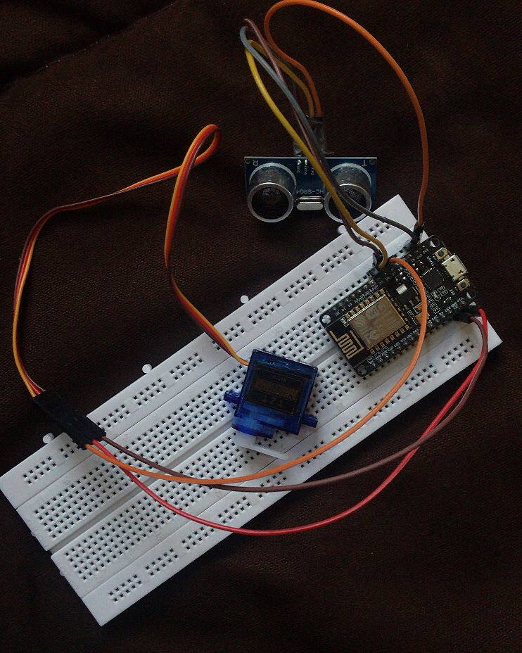

# ESP-SmartBin  
**A Wi-Fi-enabled smart trash bin powered by ESP8266, Ultrasonic Sensor & Servo Motor**

---

## Overview

**ESP-SmartBin** is a hygienic and futuristic solution for **hands-free waste disposal**.  
Using an **ultrasonic sensor (HC-SR04)**, the system detects when your hand is near and automatically opens the bin lid with a **servo motor**.  
This makes throwing away trash more **sanitary, modern, and IoT-inspired**. 

---

## Project Photo  

  
    
     
  <em>ESP-SmartBin</em>  

---

## How It Works

[Ultrasonic Sensor detects hand] → [ESP8266 processes distance] → [Servo motor opens lid] → [Lid closes after delay]

- The **HC-SR04 ultrasonic sensor** measures the distance.  
- If the object (hand) is closer than a threshold (e.g. 15cm), the **servo rotates** to open the lid.  
- After a short delay, the lid **automatically closes**.

---

## Usage

### 1. Hardware Setup  

- **Connections:**  
  - HC-SR04 `VCC` → **3.3V** (NodeMCU)  
  - HC-SR04 `GND` → **GND**  
  - HC-SR04 `TRIG` → **D5**  
  - HC-SR04 `ECHO` → **D6**  
  - Servo `VCC` → **VIN (5V)**  
  - Servo `GND` → **GND (shared with NodeMCU)**  
  - Servo `Signal` → **D7**  

⚡ **Important:**  
- Always **share GND** between the ESP8266 and servo power supply.  
- Use an external 5V power source (adapter or powerbank) for the servo if it draws too much current.  

---

### 2. Software Setup  

- Install **Arduino IDE**  
- Add ESP8266 support via **Board Manager**  
- Required libraries:  
  - `Servo.h`  
  - `ESP8266WiFi.h` (optional if you want IoT features later)  

Upload the provided `esp_smartbin.ino` code to your NodeMCU.  

---

### 3. Operation  

1. Power up the system  
2. Place your hand near the bin lid (within 15 cm)  
3. The lid automatically opens and closes after 2 seconds  
4. Enjoy a **hands-free, hygienic bin**!  

---

## Hardware Components  

| Component            | Description                |
|----------------------|----------------------------|
| ESP8266 Board        | NodeMCU (ESP-12E)          |
| Ultrasonic Sensor    | HC-SR04                    |
| Servo Motor          | SG90 or MG90S              |
| Jumper Wires         | Male-to-Female & Male-to-Male |
| Breadboard / Bin     | For prototyping & mounting |
| 5V Power Source      | Powerbank / Adapter        |

---

👩‍💻 Developed by Farnaz𓆩♡𓆪  
